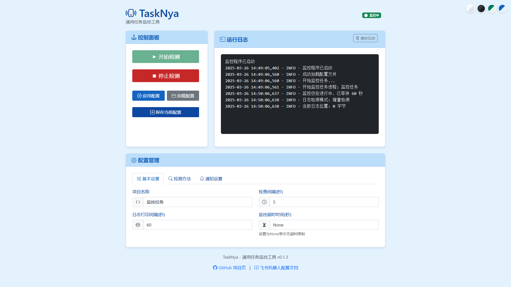

<div align="center">

# TaskNya - 实时任务监控通知系统

[项目主页](https://github.com/xueayi/TaskNya) | [用户指南](docs/user_guide.md) | [开发手册](docs/DEVELOPMENT.md) | [API 调用](docs/api_reference.md)

 


 


</div>

**TaskNya** 是一个通用的任务监控与通知工具，适用于 **深度学习训练、服务器任务、批处理脚本、日志监控、资源管理等**。  
它能够 **检测任务完成状态**（基于文件、日志、GPU 资源），并通过 **Webhook** 发送通知到 **任意支持 Webhook 的平台**（如 飞书、Astrbot 等）。  


[飞书推送效果预览](images/飞书推送.jpg)

---

## 目录

- [主要功能](#主要功能)
- [快速开始](#快速开始)
- [更多文档](#更多文档)
- [常见问题](#注意事项)

---

## 主要功能  

- [x] **文件检测**：当指定文件生成后，触发通知（适用于模型训练完成、计算结束等）。  
- [x] **日志检测**：当日志中出现指定关键字时，触发通知（支持全量和增量检测）。  
- [x] **GPU 资源检测**：当 GPU 功耗持续低于阈值时，触发通知（智能判断训练结束）。  
- [x] **多文件感知 (目录监控)**：实时监控整个目录的文件变动（新增、删除、修改），支持二次确认逻辑以确保文件写入完整，并可根据文件名提供智能操作建议。
- [x] **邮件通知**：支持通过 SMTP 服务（如 QQ、163、Gmail 等）发送通知邮件，支持自定义标题与页脚。
- [x] **二次元语录**：通知内容可选附带随机生成的二次元语录，为枯燥的科研/开发生活增添一份趣味。
- [x] **Web 管理后台**：提供实时配置、日志查看、任务控制等图形化操作。
- [X] **Docker 支持**：提供官方 Dockerfile 与 Compose 配置，支持一键部署。
- [X] **跨平台适配**：完美支持 Windows 与 Linux 环境。
- [ ] 企业微信推送 等更多平台集成中
- [ ] 更多触发条件预设 (CPU/内存/磁盘)

---

## 快速开始

### Windows (EXE方式)
1. 从 [Release](https://github.com/xueayi/TaskNya/releases) 下载 `TaskNya.exe`。
2. 双击运行，浏览器访问 `http://localhost:5000`。

### Docker 方式
```bash
docker pull xueayis/tasknya:latest
docker run -d -p 5000:5000 -v $(pwd)/logs:/app/logs xueayis/tasknya:latest
```

---

## 更多文档

详细的安装步骤、配置说明以及开发指南，请参阅以下文档：

- 完整使用教程: [用户指南 (docs/user_guide.md)](docs/user_guide.md)
- 项目架构与扩展: [开发手册 (docs/DEVELOPMENT.md)](docs/DEVELOPMENT.md)
- 接口定义: [API 参考 (docs/api_reference.md)](docs/api_reference.md)

---

## 注意事项

1. **GPU监控功能**
   - 仅在有NVIDIA显卡的环境下可用
   - 需要安装 `nvidia-ml-py3` 包
   - 无NVIDIA显卡时此功能会自动禁用

2. **Web界面使用**
   - 配置修改后需点击"应用当前配置"才会生效
   - 可以保存多个配置方案，方便切换
   - 日志面板实时显示监控状态

3. **文件路径**
   - 配置文件中的路径都相对于项目根目录

4. **监控逻辑**
   - 多个监控条件是"或"的关系
   - 任一条件满足即触发通知
   - GPU功耗检测需要连续多次满足阈值条件

5. **日志文件**
   - `webui.log`: 记录Web界面的操作日志
   - 日志文件会自动创建在 `logs` 目录下

6. **配置文件**
   - 默认配置保存在 `configs/default.yaml`
   - 自定义配置保存在 `configs` 目录下
   - 支持通过Web界面管理配置

---

## 开发 & 贡献  

欢迎贡献代码！请先 fork 项目，然后提交 Pull Request   
如果你喜欢该项目的话欢迎添加star！

---

## 许可证  

MIT License - 你可以自由使用和修改本项目。  

---
