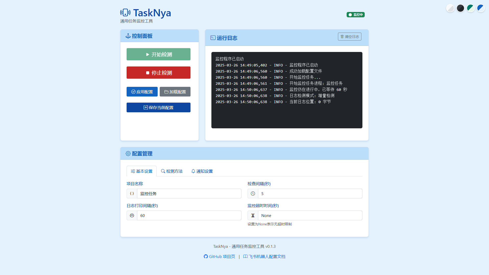

<div align="center">

# TaskNya - 通用监控与通知系统

[项目主页](https://github.com/xueayi/TaskNya) | [用户指南](docs/user_guide.md) | [开发手册](docs/DEVELOPMENT.md) | [API 参考](docs/api_reference.md) | [多平台通知配置](docs/notification_setup.md) | [内联变量参考](docs/inline_variables.md)

 


 


</div>

**TaskNya** 是一个通用的任务监控与通知工具，适用于 **通用任务的监控和通知**。  
它能够 **检测任务完成或设备状态**（基于文件、日志、GPU 资源、目录变化），并通过 **飞书 / 企业微信 / 邮件 / 通用 Webhook** 发送通知。  


[飞书推送效果预览](images/飞书推送.jpg)

---

## 目录

- [主要功能](#主要功能)
- [快速开始](#快速开始)
- [更多文档](#更多文档)
- [常见问题](#注意事项)

---

## 主要功能  

- [x] **文件检测**：当指定文件生成后，触发通知（适用于模型训练完成、计算结束等）。  
- [x] **日志检测**：当日志中出现指定关键字时，触发通知（支持全量和增量检测）。  
- [x] **GPU 资源检测**：支持功耗低于/高于阈值触发，支持连续确认次数。  
- [x] **多文件感知 (目录监控)**：实时监控整个目录的文件变动（新增、删除、修改），支持二次确认逻辑以确保文件写入完整，并可根据文件名提供智能操作建议。
- [x] **通知渠道**：飞书机器人、企业微信群机器人、邮件（SMTP）、通用 Webhook、QQ（通过 Astrbot 插件）  
- [x] **自定义文本**：飞书/企业微信/邮件支持 `template`（完全替换）与 `append`（追加）两种模式，支持 `${var}` 内联变量。
- [x] **通用 Webhook JSON 编辑器**：支持字段编辑器 / 原始 JSON 双模式，支持实时预览。
- [x] **时间配置解析**：`check_interval`、`logprint`、二次确认延迟等支持 `60`、`5m`、`1h30m` 格式。
- [x] **版本号动态化**：Web 页面版本号由根目录 `VERSION` 文件提供，发布流程自动更新。
- [x] **Web 管理后台**：提供实时配置、日志查看、任务控制等图形化操作。
- [x] **Docker 支持**：提供官方 Dockerfile 与 Compose 配置，支持一键部署。
- [x] **跨平台适配**：支持 Windows / Linux / macOS。
- [x] **HTTP/API 检测**：支持主动 HTTP 轮询和被动 API 触发端口。
- [x] **CLI 手动触发**：`python main.py --trigger` 跳过检测直接发送通知。
- [ ] 更多触发条件预设 (CPU/内存/磁盘)

---

## 快速开始

### Windows (EXE方式)
1. 从 [Release](https://github.com/xueayi/TaskNya/releases) 下载 `TaskNya.exe`。
2. 双击运行，浏览器访问 `http://localhost:9870`。

### Docker 方式

```bash
docker pull xueayis/tasknya:latest
docker run -d -p 9870:9870 -v $(pwd)/logs:/app/logs xueayis/tasknya:latest
```

或使用 Docker Compose：

```yaml
# docker-compose.yml
services:
  tasknya:
    image: xueayis/tasknya:latest
    container_name: tasknya
    ports:
      - "9870:9870"
    volumes:
      - ./configs:/app/configs      # 配置文件持久化
      - ./logs:/app/logs             # 日志持久化
      - ./monitor_targets:/app/monitor_targets  # 监控目标文件
    environment:
      - TASKNYA_HOST=0.0.0.0
      - TASKNYA_PORT=9870
    restart: unless-stopped
```

```bash
docker compose up -d        # 启动
docker compose logs -f      # 查看日志
docker compose down         # 停止
```

### Python 源码方式
```bash
pip install -r requirements.txt
python webui.py
```

浏览器访问：`http://localhost:9870`

### 命令行快速启动（无需 Web UI）

```bash
python main.py                                    # 启动监控（默认配置）
python main.py --trigger                          # 手动触发通知（测试用）
python main.py --trigger --message "训练完成"      # 附带自定义消息
bash run_monitor.sh                               # 交互选择配置并启动
```

详见 [CLI 使用指南](docs/cli_usage.md)

---

## 更多文档

详细的安装步骤、配置说明以及开发指南，请参阅以下文档：

- 完整使用教程：[`docs/user_guide.md`](docs/user_guide.md)
- 项目架构与扩展：[`docs/DEVELOPMENT.md`](docs/DEVELOPMENT.md)
- 接口定义：[`docs/api_reference.md`](docs/api_reference.md)
- 多平台通知配置：[`docs/notification_setup.md`](docs/notification_setup.md)
- 内联变量参考：[`docs/inline_variables.md`](docs/inline_variables.md)
- CLI 使用指南：[`docs/cli_usage.md`](docs/cli_usage.md)

---

## 注意事项

1. **GPU监控功能**
   - 仅在有NVIDIA显卡的环境下可用
   - 需要安装 `nvidia-ml-py3` 包
   - 无NVIDIA显卡时此功能会自动禁用

2. **Web 界面使用**
   - 配置修改后需点击"应用当前配置"才会生效
   - 可以保存多个配置方案，方便切换
   - 日志面板实时显示监控状态

3. **文件路径**
   - 配置文件中的路径都相对于项目根目录

4. **监控逻辑**
   - 多个监控条件是"或"的关系
   - 任一条件满足即触发通知
   - GPU功耗检测需要连续多次满足阈值条件
   - 目录/文件二次确认延迟支持 `30s`、`2m` 等时间格式

5. **日志文件**
   - `webui.log`: 记录 Web 界面的操作日志
   - 日志文件会自动创建在 `logs` 目录下

6. **配置文件**
   - 默认配置保存在 `configs/default.yaml`
   - 自定义配置保存在 `configs` 目录下
   - 支持通过Web界面管理配置
   - 版本号来自根目录 `VERSION`

---

## 开发 & 贡献  

欢迎贡献代码！请先 fork 项目，然后提交 Pull Request   
如果你喜欢该项目的话欢迎添加star！

---

## 许可证  

MIT License - 你可以自由使用和修改本项目。  

---
