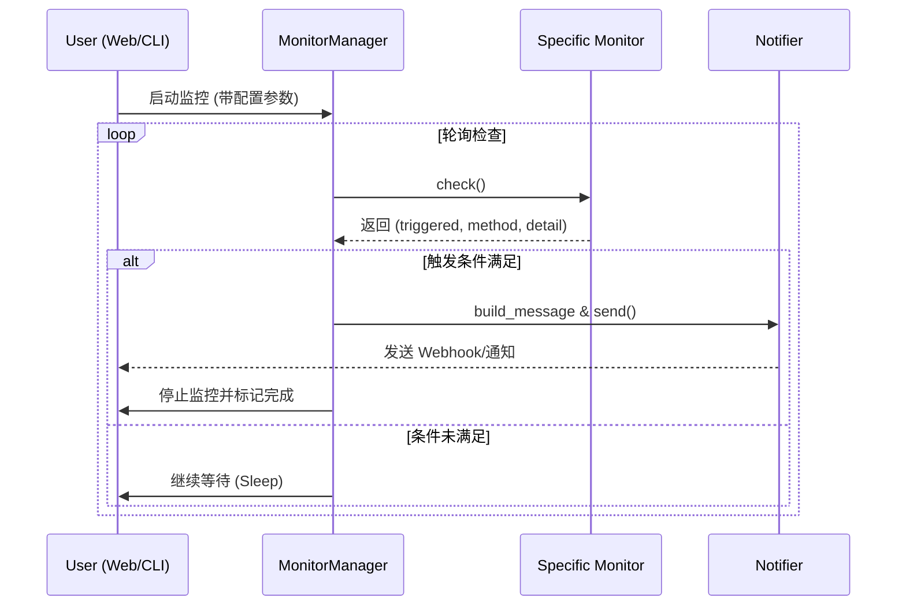

# TaskNya 开发手册

> 更新日期: 2026-01-15

---

## 目录

- [项目概览](#项目概览)
- [架构设计](#架构设计)
    - [目录结构](#目录结构)
    - [核心数据流](#核心数据流)
- [扩展开发指南（新功能添加）](#扩展开发指南新功能添加)
    - [1. 添加新的监控器 (Monitor)](#1-添加新的监控器-monitor)
    - [2. 添加新的通知器 (Notifier)](#2-添加新的通知器-notifier)
    - [3. Web UI 界面扩展](#3-web-ui-界面扩展)
- [核心模块详解](#核心模块详解)
- [配置系统](#配置系统)
- [测试与验证](#测试与验证)
- [调试指南](#调试指南)

---

## 项目概览

**TaskNya** 采用模块化设计，旨在提供一个可扩展的实时任务监控框架。核心逻辑（`core/`）与展现层（`app/` / `main.py`）解耦。

### 技术栈
- **后端**: Python 3.12, Flask, Flask-Sock (WebSocket)
- **核心**: 抽象基类 (ABC), YAML 配置管理
- **前端**: Vanilla JS, Bootstrap 5, BiIcons

---

## 架构设计

### 目录结构

```text
TaskNya/
├── core/                # 核心业务逻辑（纯 Python，不依赖 Flask）
│   ├── config/          # 配置加载、校验与默认值
│   ├── monitor/         # 监控器实现（文件、日志、GPU 等）
│   ├── notifier/        # 通知器实现（Webhook、消息构建）
│   └── utils/           # 通用工具（GPU 接口、日志配置）
├── app/                 # Web UI 后端（Flask）
│   ├── routes/          # REST API 路由
│   ├── websocket/       # WebSocket 实时推送逻辑
│   ├── static/          # 前端 JS/CSS
│   └── templates/       # HTML 模板
├── main.py              # 命令行运行入口
└── webui.py             # Web 界面运行入口
```

### 核心数据流

下面展示了监控任务从启动到触发通知的时序图：



---

## 扩展开发指南（新功能添加）

添加新功能通常涉及：**定义逻辑** -> **定义配置** -> **注册模块** -> **(可选) 更新 UI**。

### 1. 添加新的监控器 (Monitor)

如果你想监控某种新的资源（例如：Redis 队列长度、CPU 温度等）：

1.  **实现逻辑**：在 `core/monitor/` 下新建文件（如 `cpu_monitor.py`），继承 `BaseMonitor`。
    ```python
    from core.monitor.base import BaseMonitor
    
    class CpuMonitor(BaseMonitor):
        def __init__(self, config):
            self._enabled = config.get('check_cpu_enabled', False)
            self.threshold = config.get('check_cpu_threshold', 80.0)
            
        def check(self):
            # 实现你的检测逻辑
            import psutil
            usage = psutil.cpu_percent()
            if usage > self.threshold:
                return True, "CPU监控", f"当前使用率 {usage}%"
            return False, "", None
            
        @property
        def name(self) -> str: return "CPU监控"
        
        @property
        def enabled(self) -> bool: return self._enabled
    ```

2.  **定义默认配置**：在 `core/config/defaults.py` 的 `DEFAULT_CONFIG['monitor']` 中添加新字段。
    ```python
    'check_cpu_enabled': False,
    'check_cpu_threshold': 80.0,
    ```

3.  **注册监控器**：在 `core/monitor/monitor_manager.py` 的 `__init__` 方法中实例化你的类并加入 `self.monitors` 列表。

### 2. 添加新的通知器 (Notifier)

如果你想支持邮件、Telegram 等非 Webhook 方式：

1.  **实现逻辑**：在 `core/notifier/` 下新建类，继承 `BaseNotifier`。
    ```python
    class EmailNotifier(BaseNotifier):
        def send(self, message: dict) -> bool:
            # 使用 smtplib 发送邮件
            return True
    ```

2.  **集成到发送链路**：
    - 在 `core/notifier/__init__.py` 中导出。
    - 在 `main.py` 或 Web 端启动逻辑中配置并调用。目前项目主要通过 `WebhookNotifier` 配合 `MessageBuilder` 处理。

### 3. Web UI 界面扩展

当你添加了新的监控字段，需要让用户能在网页上配置：

1.  **修改 HTML**：在 `app/templates/index.html` 中添加对应的表单项。注意 `name` 属性需遵循 `section.field` 格式（如 `monitor.check_cpu_enabled`）。
2.  **修改 JS 采集逻辑**：在 `app/static/js/main.js` 的 `collectFormData` 函数中处理新类型的数据。
    - 如果是数值，确保使用了 `parseFloat` 或 `parseInt`。
    - 如果是复选框，确保处理了布尔值转换。
3.  **配置合并**：后端 `api/config/apply` 会自动处理收到的 JSON 并与默认值合并。

---

## 核心模块详解

### 配置管理 (`core/config/`)
- `ConfigManager`: 处理 YAML 读写。核心方法是 `merge_config`，它确保无论用户提供多少参数，最后生成的配置都包含所有必需项。
- 校验逻辑：`validate_config` 可用于检查关键路径是否存在。

### 监控管理 (`core/monitor/`)
- `MonitorManager` 负责协调。它会遍历所有 **已启用** 的监控器。只要有一个返回 `Triggered=True`，整个监控任务就会声明结束。

---

## 配置系统

新功能必须配有相关的测试用例：
1.  **单元测试**：在 `tests/` 下参考 `test_monitors.py` 编写针对新类的测试。
2.  **前端验证**：启动 `webui.py`，进入调试模式（`python webui.py --debug`），观察控制台输出和页面表现。

---

## 调试指南

- **后端调试**：
    - 运行 `python webui.py --debug`。这会开启 Flask 的热重载和详细日志。
    - 查看 `logs/monitor.log` 获取监控核心的详细轨迹。
- **前端调试**：
    - 使用浏览器 `F12` 查看 Network 选项卡，确保 `/api/config/apply` 发送的内容符合预期。
    - 查看 Console 了解 WebSocket (`/ws`) 的连接状态。

---

> [!TIP]
> 贡献代码前请确保运行 `pytest` 通过所有现有测试。

*本文档由 TaskNya 架构组维护。如有疑问，请咨询核心开发成员。*
