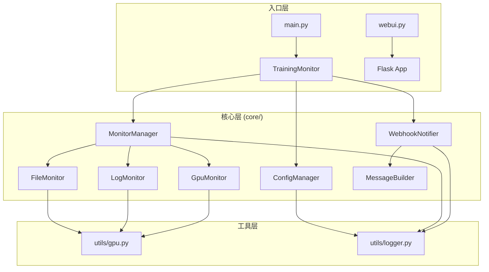

# TaskNya 开发手册

> 版本: 2.0.0  
> 更新日期: 2026-01-12

---

## 目录

- [项目概览](#项目概览)
- [架构设计](#架构设计)
- [模块详解](#模块详解)
- [API 接口说明](#api-接口说明)
- [扩展开发指南](#扩展开发指南)
- [配置参考](#配置参考)
- [测试指南](#测试指南)
- [调试指南](#调试指南)
- [常见问题](#常见问题)

---

## 项目概览

**TaskNya** 是一个通用的任务监控与通知工具，适用于深度学习训练、服务器任务、批处理脚本等场景。

### 核心功能

| 功能 | 描述 |
|------|------|
| 文件检测 | 当指定文件生成后触发通知 |
| 日志检测 | 当日志中出现指定关键词时触发通知 |
| GPU 功耗检测 | 当 GPU 功耗持续低于阈值时触发通知 |
| Webhook 通知 | 支持飞书、钉钉、Slack 等平台 |
| Web 界面 | 提供直观的配置和监控界面 |

### 技术栈

- **后端**: Python 3.8+, Flask
- **前端**: HTML, CSS, JavaScript
- **通信**: WebSocket (flask-sock)
- **配置**: YAML
- **测试**: pytest

---

## 架构设计

### 目录结构

```
TaskNya/
├── core/                          # 核心业务逻辑
│   ├── config/                    # 配置管理模块
│   │   ├── __init__.py
│   │   ├── config_manager.py      # 配置加载/保存/校验
│   │   └── defaults.py            # 默认配置定义
│   ├── monitor/                   # 监控模块
│   │   ├── __init__.py
│   │   ├── base.py                # 监控器抽象基类
│   │   ├── file_monitor.py        # 文件存在检测
│   │   ├── log_monitor.py         # 日志关键词检测
│   │   ├── gpu_monitor.py         # GPU 功耗检测
│   │   └── monitor_manager.py     # 监控器管理
│   ├── notifier/                  # 通知模块
│   │   ├── __init__.py
│   │   ├── base.py                # 通知器抽象基类
│   │   ├── webhook_notifier.py    # Webhook 通知
│   │   └── message_builder.py     # 消息构建
│   └── utils/                     # 工具模块
│       ├── __init__.py
│       ├── gpu.py                 # GPU 工具函数
│       └── logger.py              # 日志配置
├── app/                           # Flask Web 应用
│   ├── app.py                     # 应用主文件
│   ├── static/                    # 静态资源
│   └── templates/                 # HTML 模板
├── tests/                         # 测试套件
│   ├── conftest.py                # pytest 配置
│   ├── test_config.py             # 配置模块测试
│   ├── test_monitors.py           # 监控模块测试
│   ├── test_notifier.py           # 通知模块测试
│   ├── test_integration.py        # 集成测试
│   └── test_api.py                # API 测试
├── configs/                       # 配置文件目录
├── logs/                          # 日志目录
├── main.py                        # CLI 入口
└── webui.py                       # Web 入口
```

### 模块关系图



---

## 模块详解

### 1. 配置模块 (core/config/)

#### ConfigManager

配置管理器，负责配置的加载、保存、合并和验证。

```python
from core.config import ConfigManager, DEFAULT_CONFIG

# 创建管理器
manager = ConfigManager(config_dir='./configs')

# 加载配置
config = manager.load_config('my_config.yaml')

# 保存配置
manager.save_config(config, 'backup.yaml')

# 合并配置（用户配置覆盖默认配置）
merged = ConfigManager.merge_config(user_config, DEFAULT_CONFIG)

# 验证配置
is_valid = ConfigManager.validate_config(config)
```

#### DEFAULT_CONFIG

默认配置字典，定义了所有配置项的默认值。

---

### 2. 监控模块 (core/monitor/)

#### BaseMonitor

所有监控器的抽象基类，定义了统一接口：

```python
from abc import ABC, abstractmethod
from typing import Tuple, Optional

class BaseMonitor(ABC):
    @abstractmethod
    def check(self) -> Tuple[bool, str, Optional[str]]:
        """执行检查，返回 (是否触发, 方式, 详情)"""
        pass
    
    @property
    @abstractmethod
    def name(self) -> str:
        """监控器名称"""
        pass
    
    @property
    @abstractmethod
    def enabled(self) -> bool:
        """是否启用"""
        pass
```

#### 具体监控器

| 类名 | 功能 | 触发条件 |
|------|------|----------|
| `FileMonitor` | 文件监控 | 指定文件存在 |
| `LogMonitor` | 日志监控 | 日志包含指定关键词 |
| `GpuMonitor` | GPU 监控 | 功耗连续低于阈值 |

#### MonitorManager

监控管理器，组合多个监控器，任一触发即返回：

```python
from core.monitor import MonitorManager

manager = MonitorManager(config)
triggered, method, detail = manager.check()

if triggered:
    print(f"任务完成！触发方式: {method}")
```

---

### 3. 通知模块 (core/notifier/)

#### MessageBuilder

根据配置构建通知消息：

```python
from core.notifier import MessageBuilder
from datetime import datetime

builder = MessageBuilder(webhook_config)

info = builder.build_training_info(
    start_time=datetime.now(),
    end_time=datetime.now(),
    project_name="我的项目",
    method="文件检测",
    detail="/path/to/file.pth"
)
```

#### WebhookNotifier

发送 Webhook 通知：

```python
from core.notifier import WebhookNotifier

notifier = WebhookNotifier(webhook_config)

if notifier.enabled:
    success = notifier.send(training_info)
```

---

### 4. 工具模块 (core/utils/)

#### GPU 工具

```python
from core.utils import get_gpu_info, get_gpu_power_info

# 获取详细 GPU 信息
info_str = get_gpu_info()

# 获取功耗信息
power_dict = get_gpu_power_info()  # {0: 45.0, 1: 30.0}
```

#### 日志配置

```python
from core.utils import setup_logger

logger = setup_logger(
    name='my_module',
    level=logging.INFO,
    log_file='./logs/my.log'
)
```

---

## API 接口说明

### REST API

#### 配置管理

| 方法 | 路径 | 描述 |
|------|------|------|
| GET | `/api/config` | 获取当前配置 |
| POST | `/api/config/apply` | 应用配置 |
| POST | `/api/config/save` | 保存配置到文件 |
| GET | `/api/configs` | 列出所有配置文件 |
| GET | `/api/config/load/<filename>` | 加载指定配置 |

#### 监控控制

| 方法 | 路径 | 描述 |
|------|------|------|
| POST | `/api/monitor/start` | 启动监控 |
| POST | `/api/monitor/stop` | 停止监控 |

### WebSocket

| 路径 | 描述 |
|------|------|
| `/ws` | 实时日志和状态推送 |

**消息格式:**

```json
// 日志消息
{"type": "log", "message": "2024-01-01 12:00:00 - INFO - 开始监控"}

// 状态消息
{"type": "status", "data": {"status": "running"}}

// 心跳
{"type": "ping"}
```

---

## 扩展开发指南

### 添加新的监控器

1. 在 `core/monitor/` 下创建新文件：

```python
# core/monitor/process_monitor.py
from core.monitor.base import BaseMonitor

class ProcessMonitor(BaseMonitor):
    def __init__(self, config):
        self._enabled = config.get('check_process_enabled', False)
        self.process_name = config.get('check_process_name', '')
    
    @property
    def name(self) -> str:
        return "进程监控"
    
    @property
    def enabled(self) -> bool:
        return self._enabled
    
    def check(self):
        # 实现检测逻辑
        import subprocess
        try:
            result = subprocess.run(['pgrep', self.process_name], 
                                    capture_output=True)
            if result.returncode != 0:
                return True, "进程检测", self.process_name
        except:
            pass
        return False, "未完成", None
```

2. 在 `core/monitor/__init__.py` 中导出：

```python
from core.monitor.process_monitor import ProcessMonitor
__all__.append('ProcessMonitor')
```

3. 在 `MonitorManager` 中注册：

```python
# monitor_manager.py
self.monitors = [
    FileMonitor(monitor_config),
    LogMonitor(monitor_config),
    GpuMonitor(monitor_config),
    ProcessMonitor(monitor_config),  # 新增
]
```

### 添加新的通知器

1. 继承 `BaseNotifier`：

```python
# core/notifier/email_notifier.py
from core.notifier.base import BaseNotifier

class EmailNotifier(BaseNotifier):
    def __init__(self, config):
        self._enabled = config.get('email_enabled', False)
        self.smtp_server = config.get('smtp_server', '')
        # ...
    
    @property
    def enabled(self) -> bool:
        return self._enabled
    
    def send(self, message: dict) -> bool:
        # 实现邮件发送逻辑
        pass
```

---

## 配置参考

### 完整配置示例

```yaml
monitor:
  # 基本设置
  project_name: "深度学习训练"      # 项目名称
  check_interval: 5                # 检查间隔（秒）
  timeout: null                    # 超时时间，null 表示不超时
  logprint: 60                     # 状态日志打印间隔（秒）
  
  # 文件监控
  check_file_enabled: true
  check_file_path: "./output/model_final.pth"
  
  # 日志监控
  check_log_enabled: false
  check_log_path: "./logs/training.log"
  check_log_markers:
    - "Training completed"
    - "训练完成"
  check_log_mode: "full"           # "full" 或 "incremental"
  
  # GPU 功耗监控
  check_gpu_power_enabled: false
  check_gpu_power_threshold: 50.0  # 功耗阈值（瓦特）
  check_gpu_power_gpu_ids: "all"   # "all" 或 [0, 1]
  check_gpu_power_consecutive_checks: 3  # 连续检测次数

webhook:
  enabled: true
  url: "https://open.feishu.cn/open-apis/bot/v2/hook/xxx"
  title: "🎉 任务完成通知"
  color: "green"                   # green/blue/red/grey/turquoise
  
  # 消息内容控制
  include_project_name: true
  include_project_name_title: "训练项目"
  include_start_time: true
  include_start_time_title: "训练开始"
  include_end_time: true
  include_end_time_title: "训练结束时间"
  include_method: true
  include_method_title: "系统判断依据"
  include_duration: true
  include_duration_title: "总耗时"
  include_hostname: true
  include_hostname_title: "主机名"
  include_gpu_info: true
  include_gpu_info_title: "GPU信息"
  
  footer: "此消息由TaskNya发送"
```

---

## 测试指南

### 运行测试

```bash
# 安装测试依赖
pip install pytest pytest-cov

# 运行所有测试
pytest

# 运行特定测试文件
pytest tests/test_config.py

# 运行带覆盖率报告
pytest --cov=core --cov=app tests/

# 运行并显示详细输出
pytest -v
```

### 测试结构

| 文件 | 测试内容 |
|------|----------|
| `test_config.py` | 配置加载、保存、合并、验证 |
| `test_monitors.py` | 各监控器功能 |
| `test_notifier.py` | 消息构建、Webhook 发送 |
| `test_integration.py` | 完整监控流程 |
| `test_api.py` | Web API 接口 |
| `test_utils.py` | GPU 工具函数 |
| `test_websocket.py` | WebSocket 模块 |
| `test_routes.py` | 路由模块 |

---

## 调试指南

### Web 界面调试模式

TaskNya 提供了完整的调试模式支持，可通过命令行参数或环境变量启用。

#### 命令行参数

```bash
# 查看帮助
python webui.py --help

# 启用调试模式
python webui.py --debug
python webui.py -d

# 指定端口
python webui.py --port 8080
python webui.py -p 8080

# 调试模式 + 自定义端口
python webui.py -d -p 8080

# 仅显示详细日志（不开启完整调试模式）
python webui.py --verbose
python webui.py -v

# 指定主机地址
python webui.py --host 127.0.0.1
```

#### 环境变量

| 变量 | 说明 | 示例 |
|------|------|------|
| `TASKNYA_DEBUG` | 启用调试模式 | `1`, `true`, `yes` |
| `TASKNYA_PORT` | Web 服务端口 | `8080` |
| `TASKNYA_HOST` | Web 服务主机地址 | `0.0.0.0` |

```bash
# Windows
set TASKNYA_DEBUG=1
set TASKNYA_PORT=8080
python webui.py

# Linux/Mac
export TASKNYA_DEBUG=1
export TASKNYA_PORT=8080
python webui.py
```

#### 调试模式功能

| 功能 | 正常模式 | 调试模式 |
|------|----------|----------|
| **自动重载** | ❌ 关闭 | ✅ 开启（代码修改自动重启） |
| **详细错误** | ❌ 隐藏 | ✅ 显示完整堆栈信息 |
| **交互式调试器** | ❌ 禁用 | ✅ 可在错误页面调试 |
| **日志级别** | WARNING | DEBUG |
| **Werkzeug 日志** | ERROR | INFO |

#### 启动信息示例

**正常模式：**
```
==================================================
  TaskNya Web 界面
==================================================

  访问地址: http://0.0.0.0:5000
  本地访问: http://localhost:5000

  按 Ctrl+C 停止服务
==================================================
```

**调试模式：**
```
==================================================
  TaskNya Web 界面
==================================================
  ⚠️  调试模式已启用
     - 自动重载: 开启
     - 详细错误: 开启
     - 日志级别: DEBUG

  访问地址: http://0.0.0.0:5000
  本地访问: http://localhost:5000

  按 Ctrl+C 停止服务
==================================================
```

---

### 日志级别配置

```python
import logging
from core.utils import setup_logger

# 方式1：全局设置
logging.getLogger().setLevel(logging.DEBUG)

# 方式2：使用统一日志配置
logger = setup_logger(
    name='my_module',
    level=logging.DEBUG,
    log_file='./logs/debug.log'
)

# 使用日志
logger.debug("调试信息 - 仅在 DEBUG 级别显示")
logger.info("普通信息")
logger.warning("警告信息")
logger.error("错误信息")
```

---

### 断点调试

#### 使用 pdb

```python
import pdb

def my_function():
    x = 10
    pdb.set_trace()  # 程序会在此暂停
    y = x * 2
    return y
```

#### 使用 breakpoint()（Python 3.7+）

```python
def my_function():
    x = 10
    breakpoint()  # 自动使用配置的调试器
    y = x * 2
```

#### 常用调试命令

在 pdb 调试器中：

| 命令 | 说明 |
|------|------|
| `n` | 执行下一行 |
| `s` | 进入函数 |
| `c` | 继续执行 |
| `p var` | 打印变量值 |
| `l` | 显示当前代码 |
| `q` | 退出调试器 |

---

### VS Code 远程调试

```python
# 安装 debugpy
pip install debugpy

# 在代码中添加
import debugpy
debugpy.listen(("0.0.0.0", 5678))
print("等待调试器连接...")
debugpy.wait_for_client()
```

然后在 VS Code 中配置 `launch.json`：

```json
{
    "name": "Python: 远程连接",
    "type": "python",
    "request": "attach",
    "connect": {
        "host": "localhost",
        "port": 5678
    }
}
```

## 常见问题

### Q: 如何添加新的触发条件？

A: 参考[扩展开发指南](#扩展开发指南)，创建新的监控器类并继承 `BaseMonitor`。

### Q: 如何支持其他通知平台？

A: 创建新的通知器类继承 `BaseNotifier`，实现 `send()` 方法。

### Q: GPU 监控不工作？

A: 确保：
1. 安装了 NVIDIA 显卡
2. `nvidia-smi` 命令可用
3. 配置中 `check_gpu_power_enabled` 为 `true`

### Q: 日志增量检测不触发？

A: 增量模式从监控开始时的文件位置开始检测，只检测新增内容。确保完成标记是在监控启动后写入的。

---

## 贡献指南

1. Fork 项目
2. 创建功能分支: `git checkout -b feature/new-feature`
3. 确保测试通过: `pytest`
4. 提交代码: `git commit -m 'Add new feature'`
5. 推送分支: `git push origin feature/new-feature`
6. 创建 Pull Request

---

*本文档由 TaskNya 开发团队维护*
