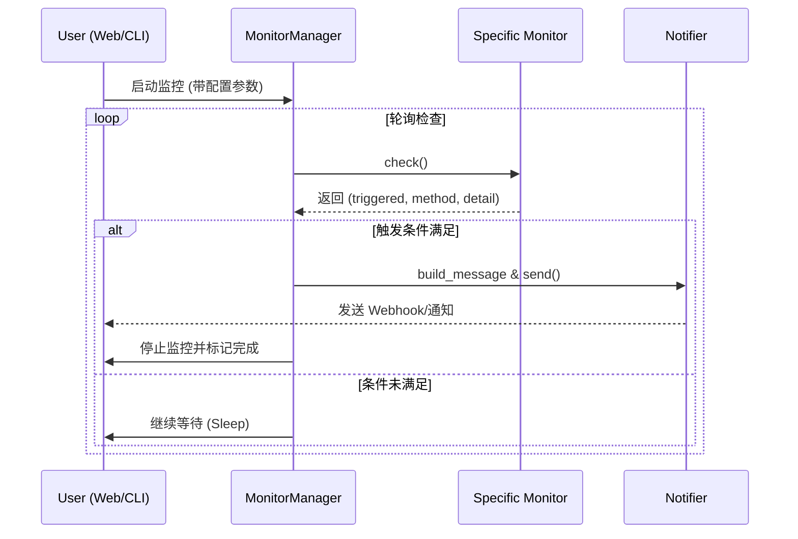

# TaskNya 开发手册

> 更新日期: 2026-04-28

---

## 目录

- [项目概览](#项目概览)
- [版本号管理与发布流程](#版本号管理与发布流程)
- [架构设计](#架构设计)
    - [目录结构](#目录结构)
    - [核心数据流](#核心数据流)
- [扩展开发指南（新功能添加）](#扩展开发指南新功能添加)
    - [1. 添加新的监控器 (Monitor)](#1-添加新的监控器-monitor)
    - [2. 添加新的通知器 (Notifier)](#2-添加新的通知器-notifier)
    - [3. Web UI 界面扩展](#3-web-ui-界面扩展)
- [核心模块详解](#核心模块详解)
- [配置系统](#配置系统)
- [测试与验证](#测试与验证)
- [调试指南](#调试指南)

---

## 项目概览

**TaskNya** 采用模块化设计，旨在提供一个可扩展的实时任务监控框架。核心逻辑（`core/`）与展现层（`app/` / `main.py`）解耦。

### 技术栈
- **后端**: Python 3.12, Flask, Flask-Sock (WebSocket)
- **核心**: 抽象基类 (ABC), YAML 配置管理
- **前端**: Vanilla JS, Bootstrap 5, BiIcons
- **通知**: `WeComNotifier` 为企业微信群机器人通知器；`MessageBuilder` 提供统一的变量替换入口（`replace_variables` / `build_context`），供各渠道复用。
- **配置校验**: 时间类字段在验证链路中通过 `parse_time_to_seconds` 解析，支持 `1h30m` 等人性化时长写法（与纯秒数兼容）。

---

## 版本号管理与发布流程

### 版本号来源

项目版本号的**唯一来源**为仓库根目录下的 `VERSION` 文件（当前：`1.2.0`）。运行中的程序与 Web UI 均**运行时读取**该文件，不在代码中手写死版本号。

### 本地开发时更新版本号

修改根目录 **`VERSION`** 文件中的版本字符串即可（如 `1.3.0`），**无需**再改其它源码文件。Web UI 页脚通过 `app/app.py` 中的 `_read_version()` 读取该文件内容并展示。

### CI/CD 自动发布流程

发布流水线定义在 `.github/workflows/main_workflow.yml`。

**触发条件**：向远程仓库推送符合 `v*` 命名的 **Git tag**（例如 `v1.3.0`）。

**Job 概要**：

1. **`build-docker`**（Ubuntu）：Checkout 后执行 `python scripts/update_version.py <tag>`，将 tag 对应的版本写入根目录 **`VERSION`**；登录 Docker Hub，构建并推送镜像 **`xueayis/tasknya:latest`** 与同 tag 的版本标签 **`xueayis/tasknya:v1.3.0`**（标签名与所推 tag 一致）。
2. **`build-exe`**（Windows）：同样先运行 `scripts/update_version.py` 刷新 **`VERSION`**，再用 PyInstaller 按 `TaskNya.spec` 构建 Windows 可执行文件，并按 tag 命名产物。
3. **`create-release`**（Ubuntu，依赖前两步）：拉取 exe 工件，拼装 Release 正文并创建 **GitHub Release**，将 exe 作为附件上传。

其中 **`scripts/update_version.py`** 在 CI 中负责把 **`vX.Y.Z` 格式的 tag 规范化为 `X.Y.Z`** 并写入 **`VERSION`** 文件（单一事实来源与各处的动态读取保持一致）。

### 发布新版本的推荐步骤

```
1. 更新 VERSION 文件为新版本号（如 1.3.0）
2. 提交代码：git add . && git commit -m "release: v1.3.0"
3. 创建并推送 tag：git tag v1.3.0 && git push origin v1.3.0
4. CI/CD 自动构建镜像、exe，并创建 GitHub Release
```

若在发布时需要附带由你撰写的变更说明，可在仓库根目录准备 **`RELEASE_NOTES.md`**；`create-release` 阶段会将该文件内容并入 Release 正文（若文件不存在则仅使用自动生成的基础说明）。

---

## 架构设计

### 目录结构

```text
TaskNya/
├── VERSION              # 当前版本号（发布/构建时写入，供程序与 UI 动态读取）
├── core/                # 核心业务逻辑（纯 Python，不依赖 Flask）
│   ├── config/          # 配置加载、校验与默认值
│   ├── monitor/         # 监控器实现（文件、日志、GPU 等）
│   ├── notifier/        # 通知器实现（Webhook、邮件、企业微信、消息构建等）
│   │   └── wecom_notifier.py  # 企业微信（群机器人）通知器
│   └── utils/           # 通用工具（GPU 接口、日志配置）
├── app/                 # Web UI 后端（Flask）
│   ├── routes/          # REST API 路由
│   ├── websocket/       # WebSocket 实时推送逻辑
│   ├── static/          # 前端 JS/CSS
│   └── templates/       # HTML 模板
├── docs/
│   ├── notification_setup.md   # 多平台通知与渠道配置说明
│   └── inline_variables.md     # 通知模板内联变量参考
├── main.py              # 命令行运行入口
└── webui.py             # Web 界面运行入口
```

### 核心数据流

下面展示了监控任务从启动到触发通知的时序图：


```mermaid
sequenceDiagram
    participant U as User (Web/CLI)
    participant M as MonitorManager
    participant S as Specific Monitor
    participant N as Notifier
    
    U->>M: 启动监控 (带配置参数)
    loop 轮询检查
        M->>S: check()
        S-->>M: 返回 (triggered, method, detail)
        alt 触发条件满足
            M->>N: build_message & send()
            N-->>U: 发送 Webhook/通知
            M->>U: 停止监控并标记完成
        else 条件未满足
            M->>U: 继续等待 (Sleep)
        end
    end
```

---

## 扩展开发指南（新功能添加）

添加新功能通常涉及：**定义逻辑** -> **定义配置** -> **注册模块** -> **(可选) 更新 UI**。

### 1. 添加新的监控器 (Monitor)

如果你想监控某种新的资源（例如：Redis 队列长度、CPU 温度等）：

1.  **实现逻辑**：在 `core/monitor/` 下新建文件（如 `cpu_monitor.py`），继承 `BaseMonitor`。
    ```python
    from core.monitor.base import BaseMonitor
    
    class CpuMonitor(BaseMonitor):
        def __init__(self, config):
            self._enabled = config.get('check_cpu_enabled', False)
            self.threshold = config.get('check_cpu_threshold', 80.0)
            
        def check(self):
            # 实现你的检测逻辑
            import psutil
            usage = psutil.cpu_percent()
            if usage > self.threshold:
                return True, "CPU监控", f"当前使用率 {usage}%"
            return False, "", None
            
        @property
        def name(self) -> str: return "CPU监控"
        
        @property
        def enabled(self) -> bool: return self._enabled
    ```

2.  **定义默认配置**：在 `core/config/defaults.py` 的 `DEFAULT_CONFIG['monitor']` 中添加新字段。
    ```python
    'check_cpu_enabled': False,
    'check_cpu_threshold': 80.0,
    ```

3.  **注册监控器**：在 `core/monitor/monitor_manager.py` 的 `__init__` 方法中实例化你的类并加入 `self.monitors` 列表。

### 2. 添加新的通知器 (Notifier)

如果你想支持 Telegram 等新方式：

1.  **实现逻辑**：在 `core/notifier/` 下新建类，继承 `BaseNotifier`。参考 `EmailNotifier` 的实现。
    ```python
    class MyNewNotifier(BaseNotifier):
        def send(self, message: dict) -> bool:
            # 实现你的发送逻辑
            return True
    ```

2.  **集成到发送链路**：
    - 在 `core/notifier/__init__.py` 中导出。
    - 在 `main.py` 中像 `_email_notifier` 一样进行初始化和调用。

### 3. Web UI 界面扩展

当你添加了新的监控字段，需要让用户能在网页上配置：

1.  **修改 HTML**：在 `app/templates/index.html` 中添加对应的表单项。注意 `name` 属性需遵循 `section.field` 格式（如 `monitor.check_cpu_enabled`）。
2.  **修改 JS 采集逻辑**：在 `app/static/js/main.js` 的 `collectFormData` 函数中处理新类型的数据。
    - 如果是数值，确保使用了 `parseFloat` 或 `parseInt`。
    - 如果是复选框，确保处理了布尔值转换。
3.  **配置合并**：后端 `api/config/apply` 会自动处理收到的 JSON 并与默认值合并。

---

## 核心模块详解

### 配置管理 (`core/config/`)
- `ConfigManager`: 处理 YAML 读写。核心方法是 `merge_config`，它确保无论用户提供多少参数，最后生成的配置都包含所有必需项。
- 校验逻辑：`validate_config` 可用于检查关键路径是否存在。

### 监控管理 (`core/monitor/`)
- `MonitorManager` 负责协调。它会遍历所有 **已启用** 的监控器。只要有一个返回 `Triggered=True`，整个监控任务就会声明结束。

---

## 配置系统

新功能必须配有相关的测试用例：
1.  **单元测试**：在 `tests/` 下参考 `test_monitors.py` 编写针对新类的测试。
2.  **前端验证**：启动 `webui.py`，进入调试模式（`python webui.py --debug`），观察控制台输出和页面表现。

---

## 调试指南

- **后端调试**：
    - 运行 `python webui.py --debug`。这会开启 Flask 的热重载和详细日志。
    - 查看 `logs/monitor.log` 获取监控核心的详细轨迹。
- **前端调试**：
    - 使用浏览器 `F12` 查看 Network 选项卡，确保 `/api/config/apply` 发送的内容符合预期。
    - 查看 Console 了解 WebSocket (`/ws`) 的连接状态。

---

> [!TIP]
> 贡献代码前请确保运行 `pytest` 通过所有现有测试。

*本文档由 TaskNya 架构组维护。如有疑问，请咨询核心开发成员。*
